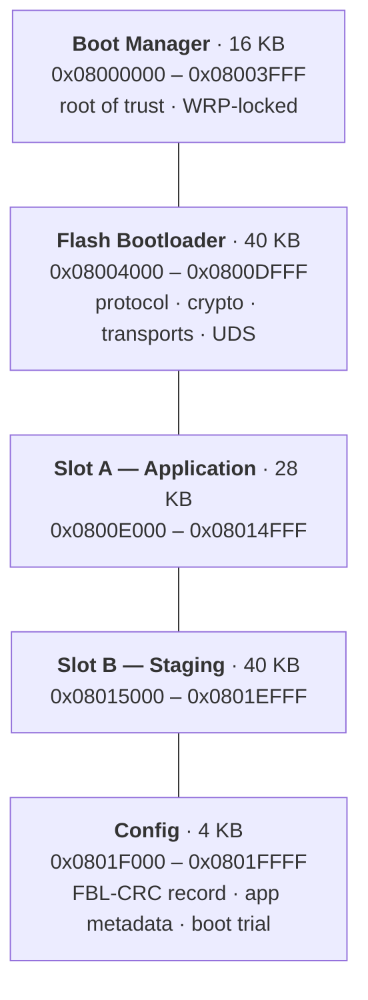
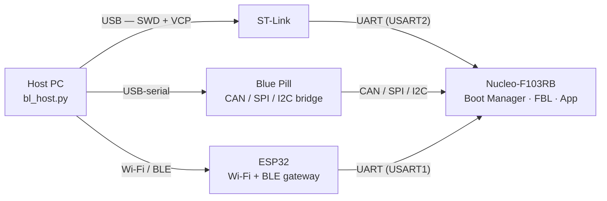

# STM32F103 Secure Bootloader

[](https://github.com/AdhamEhab14/Three-Tier-STM32-Secure-Bootloader/actions/workflows/ci.yml)


A three-tier secure bootloader for the STM32F103RBT6 (Nucleo-F103RB). It boots only firmware
signed with a trusted key, keeps that firmware encrypted in transit, refuses to roll
backward, survives a failed or crashing update, reprograms itself over the wire, and accepts
the same commands over six links — UART, CAN, SPI, I2C, Wi-Fi, and BLE. All of it is tested
on real hardware.

## Features

- **Ed25519-signed firmware.** Every image carries a signed 100-byte header; the board
  verifies it before trusting anything. The private key never leaves the PC.
- **Anti-rollback.** The signed header carries a version, and the board refuses any app
  older than the installed one, and any FBL older than the running one.
- **Encrypted firmware.** Images can be ChaCha20-encrypted end to end. The signature
  authenticates the ciphertext; the board decrypts it into the application slot on install.
- **A/B staging.** New firmware is staged and fully verified before it replaces the live
  app, so a rejected or corrupt upload just leaves the working app running.
- **Watchdog + recovery.** A freshly installed app is "on trial": it must kick a watchdog
  and confirm itself, or after a few failed boots the bootloader stops relaunching it and
  drops into recovery instead of boot-looping forever.
- **Power-on self-test (BIST).** A RAM march test, a CRC-engine check, and a supply-voltage
  reading run at every boot; a critical failure halts rather than boot something untrusted.
- **Self-update.** The bootloader can reprogram itself over any transport, staged and
  verified, then written by a small routine that runs from RAM.
- **Six transports, one protocol.** The same framed command protocol runs over UART, CAN
  (ISO-TP), SPI, I2C, Wi-Fi, and BLE.
- **UDS reprogramming.** A working ISO 14229 sequence — session control, seed/key security
  access, RequestDownload / TransferData / RoutineControl — layered over the same protocol.
  There's also a separate **standards-library port** (isotp-c for ISO 15765-2 + iso14229 for
  ISO 14229-1), tested on host, on-chip, and node-to-node over real CAN. It's a self-contained
  optional module that's deliberately kept out of the shipping bootloader to keep the FBL lean.
  See [ISO-TP_UDS_STACK.md](STM32F103RBT6_Secure_Bootloader/ISO-TP_UDS_STACK.md).
- **Locked root of trust.** The Boot Manager can be write-protected (WRP) so it's
  physically immutable, even against an ST-Link.

## Hardware required

| # | Part | Role |
|---|------|------|
| 1 | **STM32F103RBT6** — Nucleo-F103RB | runs the Boot Manager, FBL, and application |
| 1 | **ST-Link V2/V3** | flashing + the UART command port (on-board on the Nucleo) |
| 1 | **STM32F103C8T6** — "Blue Pill" | bridges the host UART to CAN / SPI / I2C *(optional)* |
| 1 | **ESP32** (WROOM) | Wi-Fi + BLE OTA gateway *(optional)* |
| 2 | **MCP2551** CAN transceivers | one per node on the CAN bus *(optional)* |
| 1 | **USB-to-TTL serial adapter** | connects the PC to the Blue Pill's UART *(optional)* |

Only the Nucleo and an ST-Link are needed for the core bootloader over UART. The Blue Pill
and ESP32 add the extra transports.

## Architecture

Three separate programs share the 128 KB of flash, each with exactly one job.

**Boot Manager** (16 KB) is the root of trust. It runs first, CRC-checks the bootloader
below it, and jumps to it. Once everything works it's write-protected, so nothing can
overwrite it — not even an ST-Link.

**Flash Bootloader / FBL** (40 KB) does the real work: it talks to the host over any of the
transports, checks signatures, decrypts and swaps firmware, runs the self-test, and can
reprogram itself.

**Application** (28 KB) is whatever you're running — here, a demo that blinks LD2 and kicks
the watchdog. On entry the app relocates its vector table (`SCB->VTOR = 0x0800E000`) so the
core finds its interrupt vectors at the slot base instead of the default `0x08000000`; the
Boot Manager and FBL do the same for their own bases.

New firmware never lands directly on the live app. It goes into a staging slot first and is
only promoted once its signature *and* version check out.

| Region | Address | Size | Purpose |
|---|---|---|---|
| Boot Manager | `0x08000000` | 16 KB | verifies and launches the FBL (write-protected) |
| Flash Bootloader | `0x08004000` | 40 KB | the bootloader itself |
| Slot A (App) | `0x0800E000` | 28 KB | the running application |
| Slot B (Staging) | `0x08015000` | 40 KB | new images land here first |
| Config | `0x0801F000` | 4 KB | FBL-CRC record, app metadata, boot-trial record |

Slot B is as large as the FBL region on purpose: a full new bootloader has to fit there to
be staged for a self-update. The self-update routine (`sbl.c`) is copied into RAM and runs
from there — it has to, because it erases the flash region it would otherwise execute from.

The FBL listens on all of its buses at once and answers on whichever one a command arrived
on. The Blue Pill is one firmware that can bridge CAN, SPI, or I2C — the host picks the bus
with a `can:` / `spi:` / `i2c:` prefix, so every link can stay wired at the same time.

## Security model

The trust anchor is asymmetric, not the chip's read protection. Firmware is verified with
Ed25519, and **the private signing key never touches the device** — it lives only on the PC.
So even full physical access buys an attacker the code and the *public* key, not the ability
to sign firmware or forge a version past anti-rollback. That guarantee is the point, and it
holds regardless of what the silicon's debug protection does.

What it does *not* fully cover on this particular MCU:

- **Confidentiality.** The ChaCha20 key is symmetric and baked into the FBL, so anyone who
  can read the flash out can decrypt firmware images. The encryption protects firmware in
  transit and against a remote attacker, not against someone holding this chip.
- **Flash read-out.** The STM32F103 has only RDP levels 0 and 1 (no level 2), and RDP-1 is
  defeated by the well-documented debug-assisted bypass (Obermaier & Tatschner, 2017): the
  debug port isn't fully disabled, so the CPU can be driven to leak flash. Only parts with
  RDP-2 or hardware secure boot (H5 / L5 / U5 with TrustZone) close that off.
- **WRP is write-only, and needs RDP-1 to be tamper-evident.** WRP blocks *writes/erase* of
  the Boot Manager — an ST-Link can't reflash it — but on its own, at RDP level 0, an
  attacker can rewrite the option bytes to clear WRP and reflash the BM. Paired with RDP
  level 1 it bites: dropping read protection forces a mass erase, so the lock can be removed
  only by wiping the chip, never by keeping a *modified* Boot Manager.

Hardening if the threat model included physical attackers:

- Enable **RDP level 1** alongside WRP so any unlock triggers a mass erase (tamper-evident).
- Move to a part with **RDP level 2 / hardware secure boot** (STM32 H5, L5, U5) to close the
  debug read-out path.
- Keep the symmetric key **off-chip** — provisioned per-device from a secure element —
  instead of baking it into the image.

None of these change the core stance: trust is anchored in the off-device private key, so the
worst a physical attacker gets is a board running their own code — which no MCU can prevent —
not the ability to forge firmware for the fleet.

## Building and running

You need STM32CubeIDE, an ST-Link, and Python with `pyserial` and `pynacl` (plus `bleak` for
the BLE link). Generate the keys once and paste what they print into `bootloader.c`
(`BL_PUBLIC_KEY[]` and `BL_ENC_KEY[]`):

```
cd host
python sign_tool.py genkey
python sign_tool.py genenckey
```

Flash the three projects with an ST-Link, in order: Boot Manager, then the FBL, then the
App. To talk to the bootloader, hold **B1** and press reset — LD2 flickers, then it waits
for the host.

Sign an app (the version enables anti-rollback) and flash it over the ST-Link COM port:

```
python sign_tool.py sign app.bin 1.0.0
python bl_host.py COMx flash app.bin
```

That stages the image in Slot B, checks the signature and version, promotes it into Slot A,
and launches it. Add `enc` to sign-and-encrypt instead:

```
python sign_tool.py sign app.bin 1.1.0 enc
python bl_host.py COMx flash app.bin
```

### Transports

Every command works over any link — only the port argument changes:

| Link | Port argument | Path to the board |
|---|---|---|
| UART | `COMx` | ST-Link virtual COM port, straight into the FBL |
| CAN | `can:COMx` | Blue Pill bridge → CAN (ISO-TP, 250 kbit/s) |
| SPI | `spi:COMx` | Blue Pill bridge → SPI (FBL is the slave) |
| I2C | `i2c:COMx` | Blue Pill bridge → I2C (FBL is the slave, addr `0x42`) |
| Wi-Fi | `tcp:192.168.4.1:3333` | ESP32 gateway → UART |
| BLE | `ble:STM32-OTA-BLE` | ESP32 gateway → UART |

SPI and I2C use a spare `DATA_READY` line so a slow command (signature verification takes a
couple of seconds) doesn't have to hold the bus while the board thinks.

### Flashing over UDS

The same install, but through a spec-shaped ISO 14229 sequence (session → seed/key unlock →
download → install routine → ECU reset):

```
python bl_host.py COMx udsinfo             # read a few data identifiers
python bl_host.py COMx udsflash app.bin    # full UDS reprogramming sequence
```

### Updating the bootloader

Sign the new FBL binary (type `fbl`) and push it over any transport:

```
python sign_tool.py sign new_fbl.bin 1.5.0 fbl
python bl_host.py COMx updatefbl new_fbl.bin
```

The board stages it, verifies it, and reprograms its own flash from RAM. The first
self-update-capable FBL has to be flashed once with an ST-Link; after that they go over the
wire.

### Locking the Boot Manager

When you're happy with everything:

```
python bl_host.py COMx lockbm
```

This write-protects the Boot Manager's pages. To change it later, re-check WRP0–3 in
STM32CubeProgrammer — that clears the lock without erasing your firmware.

## Repository layout

```
BootManager/                     immutable Boot Manager (root of trust)
STM32F103RBT6_Secure_Bootloader/ the Flash Bootloader
  Core/Src/bootloader.c            protocol, signing, anti-rollback, decrypt, BIST,
                                   boot-trial, UDS, and the UART/CAN/SPI/I2C transports
  Core/Src/can_bl.c                CAN driver + ISO-TP with flow control
  Core/Src/sbl.c                   RAM routine that reprograms the FBL
  Core/Src/flash.c / flash_if.c    bare-metal flash driver and its glue
STM32F103RBT6_Application/       demo app: blinks LD2, kicks the watchdog, self-confirms
BluePill_Bridge/                 one Blue Pill bridging UART to CAN / SPI / I2C
ESP32_OTA_Gateway/               ESP32: Wi-Fi (TCP) and BLE (NUS) gateway to the FBL UART
host/
  bl_host.py                       the CLI: version / flash / bist / udsflash / updatefbl / lockbm
  sign_tool.py                     Ed25519 + ChaCha20 key generation and signing
```

The HAL/CMSIS `Drivers/` folders and build outputs are generated and git-ignored. Open a
project's `.ioc` in STM32CubeIDE and generate code to restore them before building.

## Future work

- Delta updates — send a binary patch instead of the whole image
- True A/B ping-pong with automatic rollback to the last good app
- Ethernet OTA
- CAN-FD
- On-chip USB DFU
- An internal golden/factory recovery image
- A tamper-proof hardware rollback counter

## Diagrams

### Flash map



### Hardware topology


