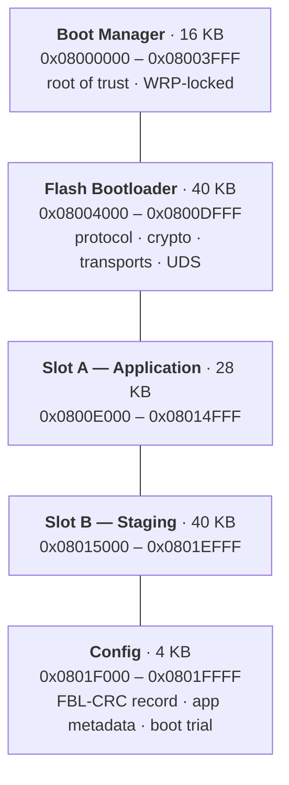
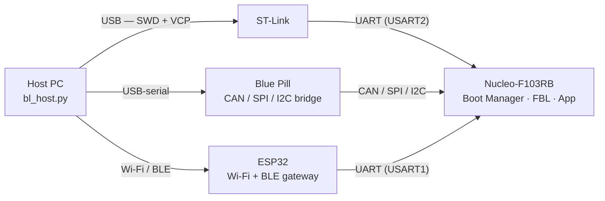

# STM32F103 Secure Bootloader

[](https://github.com/AdhamEhab14/Three-Tier-STM32-Secure-Bootloader/actions/workflows/ci.yml)
[](https://github.com/AdhamEhab14/Three-Tier-STM32-Secure-Bootloader/releases)


A three-tier secure bootloader for the STM32F103RBT6 (Nucleo-F103RB). It boots only firmware
signed with a trusted key, keeps that firmware encrypted in transit, refuses to roll
backward, survives a failed or crashing update, reprograms itself over the wire, and accepts
the same commands over six links — UART, CAN, SPI, I2C, Wi-Fi, and BLE. All of it is tested
on real hardware.

## Features

- **Ed25519-signed firmware.** Every image carries a signed 100-byte header; the board
  verifies it before trusting anything. The private key never leaves the PC.
- **Anti-rollback.** The signed header carries a version, and the board refuses any app
  older than the installed one, and any FBL older than the running one.
- **Encrypted firmware.** Images can be ChaCha20-encrypted end to end. The signature
  authenticates the ciphertext; the board decrypts it into the application slot on install.
- **A/B staging.** New firmware is staged and fully verified before it replaces the live
  app, so a rejected or corrupt upload just leaves the working app running.
- **Watchdog + recovery.** A freshly installed app is "on trial": it must kick a watchdog
  and confirm itself, or after a few failed boots the bootloader stops relaunching it and
  drops into recovery instead of boot-looping forever.
- **Power-on self-test (BIST).** A RAM march test, a CRC-engine check, and a supply-voltage
  reading run at every boot; a broken RAM or CRC engine halts rather than boot something
  untrusted. A damaged app does not: the bootloader stays up so it can be replaced.
- **Self-update.** The bootloader can reprogram itself over any transport, staged and
  verified, then written by a small routine that runs from RAM.
- **Six transports, one protocol.** The same framed command protocol runs over UART, CAN
  (ISO-TP), SPI, I2C, Wi-Fi, and BLE.
- **UDS reprogramming.** A working ISO 14229 sequence — session control (default, programming,
  extended, safety; programming only through extended), seed/key security access,
  RequestDownload / TransferData / RoutineControl — layered over the same protocol, with a
  per-service table of allowed sessions, security level and addressing.
  There's also a separate **standards-library port** (isotp-c for ISO 15765-2 + iso14229 for
  ISO 14229-1), tested on host, on-chip, and node-to-node over real CAN. It's a self-contained
  optional module that's deliberately kept out of the shipping bootloader to keep the FBL lean.
  See [ISO-TP_UDS_STACK.md](STM32F103RBT6_Secure_Bootloader/ISO-TP_UDS_STACK.md).
- **Verified boot chain.** The Boot Manager runs first and CRC-checks the FBL before handing
  control to it; the FBL verifies the app's signature at install and its CRC at every boot.
  Trust flows up from the immutable Boot Manager.
- **Locked root of trust.** The Boot Manager can be write-protected (WRP) so it's
  physically immutable, even against an ST-Link.
- **Tested, and validated in CI.** On every push the real Boot Manager and FBL run in the
  Renode emulator (signed install, rollback and tamper rejection, SecurityAccess, sessions, and
  a power cut at every kind of flash operation), next to static analysis and an off-target
  validation layer: an ISO 22901 (ODX) description of the UDS services, an ISO 14229 conformance suite, UDS
  fuzz/robustness tests, a CAN bus simulation (ISO-TP over python-can), and a CAPL tester for
  CANoe / CANalyzer — see [Diagnostics & validation](#diagnostics--validation).

## Hardware required

| # | Part | Role |
|---|------|------|
| 1 | **STM32F103RBT6** — Nucleo-F103RB | runs the Boot Manager, FBL, and application |
| 1 | **ST-Link V2/V3** | flashing + the UART command port (on-board on the Nucleo) |
| 1 | **STM32F103C8T6** — "Blue Pill" | bridges the host UART to CAN / SPI / I2C *(optional)* |
| 1 | **ESP32** (WROOM) | Wi-Fi + BLE OTA gateway *(optional)* |
| 2 | **MCP2551** CAN transceivers | one per node on the CAN bus *(optional)* |
| 1 | **USB-to-TTL serial adapter** | connects the PC to the Blue Pill's UART *(optional)* |

Only the Nucleo and an ST-Link are needed for the core bootloader over UART. The Blue Pill
and ESP32 add the extra transports.

## Architecture

Three separate programs share the 128 KB of flash, each with exactly one job.

**Boot Manager** (16 KB) is the root of trust. It runs first, CRC-checks the bootloader
below it, and jumps to it. Once everything works it's write-protected, so nothing can
overwrite it — not even an ST-Link.

**Flash Bootloader / FBL** (40 KB) does the real work: it talks to the host over any of the
transports, checks signatures, decrypts and swaps firmware, runs the self-test, and can
reprogram itself.

**Application** (28 KB) is whatever you're running — here, a demo that blinks LD2 and kicks
the watchdog. On entry the app relocates its vector table (`SCB->VTOR = 0x0800E000`) so the
core finds its interrupt vectors at the slot base instead of the default `0x08000000`; the
Boot Manager and FBL do the same for their own bases.

New firmware never lands directly on the live app. It goes into a staging slot first and is
only promoted once its signature *and* version check out.

| Region | Address | Size | Purpose |
|---|---|---|---|
| Boot Manager | `0x08000000` | 16 KB | verifies and launches the FBL (write-protected) |
| Flash Bootloader | `0x08004000` | 40 KB | the bootloader itself |
| Slot A (App) | `0x0800E000` | 28 KB | the running application |
| Slot B (Staging) | `0x08015000` | 40 KB | new images land here first |
| Config | `0x0801F000` | 4 KB | FBL-CRC record, app metadata, boot-trial record |

Slot B is as large as the FBL region on purpose: a full new bootloader has to fit there to
be staged for a self-update. The self-update routine (`sbl.c`) is copied into RAM and runs
from there — it has to, because it erases the flash region it would otherwise execute from.

The FBL listens on all of its buses at once and answers on whichever one a command arrived
on. The Blue Pill is one firmware that can bridge CAN, SPI, or I2C — the host picks the bus
with a `can:` / `spi:` / `i2c:` prefix, so every link can stay wired at the same time.

## Security model

The trust anchor is asymmetric, not the chip's read protection. Firmware is verified with
Ed25519, and **the private signing key never touches the device** — it lives only on the PC.
So even full physical access buys an attacker the code and the *public* key, not the ability
to sign firmware or forge a version past anti-rollback. That guarantee is the point, and it
holds regardless of what the silicon's debug protection does.

What it does *not* fully cover on this particular MCU:

- **Confidentiality.** The ChaCha20 key is symmetric and baked into the FBL, so anyone who
  can read the flash out can decrypt firmware images. The encryption protects firmware in
  transit and against a remote attacker, not against someone holding this chip. It has to be
  your own key (`genenckey`): the demo key in this repository protects nothing. The signed
  header also carries the CRC of the plaintext, so an image encrypted under another key is
  refused before the working app is erased, instead of installing as garbage.
- **The SecurityAccess key.** UDS `0x27` answers a seed with the first 4 bytes of AES-CMAC
  under a 128-bit key built into the FBL, so someone who can read the flash out can open
  the diagnostic gate. What the scheme does stop is a bus-side attacker: the key cannot be
  worked out from observed seed/key pairs, a seed works once, and guessing is held to about
  three tries per ten seconds. The gate only decides who may start a download; images still
  need the Ed25519 signature.
- **Flash read-out.** The STM32F103 has only RDP levels 0 and 1 (no level 2), and RDP-1 is
  defeated by the well-documented debug-assisted bypass (Obermaier & Tatschner, 2017): the
  debug port isn't fully disabled, so the CPU can be driven to leak flash. Only parts with
  RDP-2 or hardware secure boot (H5 / L5 / U5 with TrustZone) close that off.
- **WRP is write-only, and needs RDP-1 to be tamper-evident.** WRP blocks *writes/erase* of
  the Boot Manager — an ST-Link can't reflash it — but on its own, at RDP level 0, an
  attacker can rewrite the option bytes to clear WRP and reflash the BM. Paired with RDP
  level 1 it bites: dropping read protection forces a mass erase, so the lock can be removed
  only by wiping the chip, never by keeping a *modified* Boot Manager.

Hardening if the threat model included physical attackers:

- Enable **RDP level 1** alongside WRP so any unlock triggers a mass erase (tamper-evident).
- Move to a part with **RDP level 2 / hardware secure boot** (STM32 H5, L5, U5) to close the
  debug read-out path.
- Keep the symmetric key **off-chip** — provisioned per-device from a secure element —
  instead of baking it into the image.

None of these change the core stance: trust is anchored in the off-device private key, so the
worst a physical attacker gets is a board running their own code — which no MCU can prevent —
not the ability to forge firmware for the fleet.

## Power-loss safety

Flash writes are not atomic, so the bootloader has to survive a power cut during an update.
The emulator tests cut power between flash operations (and inside an erase or program as
modelled below); real flash can also be left with weak bits that no emulator reproduces, which
is why the bench plan in `docs/hardware-test.md` pulls the plug on a real board too. This is tested on the real firmware in an emulator (no hardware needed):
the flash model numbers every erase and program, stops the CPU at a chosen one, and the
resulting flash image is booted again. Cut states for every other point are generated
offline and only trusted because a real cut reproduces them byte for byte.

| Update step | What a cut leaves behind | How the device recovers |
|---|---|---|
| FBL self-update, any point after the update is recorded | old, half-erased or half-copied FBL, new image still in Slot B | the Boot Manager re-copies Slot B into the FBL region (safe to repeat) |
| App install, erase or copy of Slot A | damaged app, old metadata record still in force | the app is refused, the self-test no longer halts, the bootloader stays up for a reinstall |
| App install, metadata rewrite | old record, or a half-written new one | metadata lives in two pages and only the page that is not current is rewritten, so the rollback floor is never lost |

Run them with `cd tests/renode && python -m pytest -m powercut` (about 20 to 35 minutes;
`BL_THOROUGH=1` adds a denser sweep). Limits: a torn operation is modelled as an erase
that leaves the old, half-erased or garbage page, and a program as completed or not
started per halfword; a bit-level torn program is not modelled. If Slot B itself is
damaged while an FBL update is pending there is nothing left to recover from without a
golden image (listed under future work).

## Building and running

To build from the command line you need `arm-none-eabi-gcc`, CMake and Ninja:

```
cmake -S . -B build -G Ninja "-DCMAKE_TOOLCHAIN_FILE=cmake/arm-none-eabi.cmake" "-DBL_SEC_KEY_HEADER=host/keys/bl_seckey.h" "-DBL_ENC_KEY_HEADER=host/keys/bl_enckey.h"
cmake --build build        # boot_manager / fbl / application / bluepill_bridge .elf and .bin
```

The STM32CubeIDE projects still work too. You also need an ST-Link, and Python with `pyserial` and `pynacl` (plus `bleak` for
the BLE link). Generate the keys once and paste the public key that `genkey` prints into `bootloader.c`
(`BL_PUBLIC_KEY[]`); the other two land in git-ignored headers under `host/keys`:

```
cd host
python sign_tool.py genkey
python sign_tool.py genenckey      # image-encryption key, see below
python sign_tool.py genseckey      # SecurityAccess key, see below
```

The two secret keys are built in from those headers: pass `-DBL_SEC_KEY_HEADER=host/keys/bl_seckey.h`
and `-DBL_ENC_KEY_HEADER=host/keys/bl_enckey.h` to CMake (the host tools find the `.bin` files on
their own). Without them CMake refuses to build the FBL; `-DBL_ALLOW_DEMO_KEY=ON` gets the **public
demo keys** from `bl_seckey_demo.h` and `bl_enckey_demo.h`, which are fine for a demo and nothing
else. In CubeIDE, add the same two symbols under C/C++ Build, Settings, Preprocessor (with the
header path in quotes); without them the build falls back to the demo keys and says so. Keep in mind that the key is
symmetric and sits in flash, so it is only as secret as the chip's read-out protection (RDP).
SecurityAccess gates the diagnostic session; it is not what protects the device, because every
install still has to carry a valid Ed25519 signature.

Flash the three projects with an ST-Link, in order: Boot Manager, then the FBL, then the
App. To talk to the bootloader, hold **B1** and press reset — LD2 flickers, then it waits
for the host.

Sign an app (the version enables anti-rollback) and flash it over the ST-Link COM port:

```
python sign_tool.py sign app.bin 1.0.0
python bl_host.py COMx flash app.bin
```

That stages the image in Slot B, checks the signature and version, promotes it into Slot A,
and launches it. Add `enc` to sign-and-encrypt instead:

```
python sign_tool.py sign app.bin 1.1.0 enc
python bl_host.py COMx flash app.bin
```

### Transports

Every command works over any link — only the port argument changes:

| Link | Port argument | Path to the board |
|---|---|---|
| UART | `COMx` | ST-Link virtual COM port, straight into the FBL |
| CAN | `can:COMx` | Blue Pill bridge → CAN (ISO-TP, 250 kbit/s) |
| SPI | `spi:COMx` | Blue Pill bridge → SPI (FBL is the slave) |
| I2C | `i2c:COMx` | Blue Pill bridge → I2C (FBL is the slave, addr `0x42`) |
| Wi-Fi | `tcp:192.168.4.1:3333` | ESP32 gateway → UART |
| BLE | `ble:STM32-OTA-BLE` | ESP32 gateway → UART |

The gateway's Wi-Fi password is a published default until you copy
`ESP32_OTA_Gateway/src/gateway_secrets.example.h` to `gateway_secrets.h` (git-ignored) and set
your own; the build warns while it uses the default.

SPI and I2C use a spare `DATA_READY` line so a slow command (signature verification takes a
couple of seconds) doesn't have to hold the bus while the board thinks.

### Flashing over UDS

The same install, but through a spec-shaped ISO 14229 sequence (session → seed/key unlock →
download → install routine → ECU reset):

```
python bl_host.py COMx udsinfo             # read a few data identifiers
python bl_host.py COMx udsflash app.bin    # full UDS reprogramming sequence
```

The order on the wire is `10 03` (extended), `85 02` and `28 03 01` to quiet the bus (both are
refused in the default session), `10 02` (programming), `27` seed and key,
`34` request download, `36` blocks, `37` exit, `31` check and install,
then `11` reset. The extra `10 03` is the usual OEM flow, and it is enforced: asking for `10 02`
straight from the default session is answered `7F 10 22` (conditions not correct), so a tester that
follows the shorter flow from issue #2 has to add that one step. A programming session that is idle
for 5 s falls back to default and locks again, so keep `3E 00` going during long pauses.

### Updating the bootloader

Sign the new FBL binary (type `fbl`) and push it over any transport:

```
python sign_tool.py sign new_fbl.bin 1.5.0 fbl
python bl_host.py COMx updatefbl new_fbl.bin
```

The board stages it, verifies it, and reprograms its own flash from RAM. The first
self-update-capable FBL has to be flashed once with an ST-Link; after that they go over the
wire.

### Locking the Boot Manager

When you're happy with everything:

```
python bl_host.py COMx lockbm
```

This write-protects the Boot Manager's pages. To change it later, re-check WRP0–3 in
STM32CubeProgrammer — that clears the lock without erasing your firmware.

## Diagnostics & validation

Alongside the firmware, an off-target validation layer exercises the standards UDS server
(`iso14229` + `isotp-c`) without touching the device's flash budget — it runs on a PC, and CI
runs it on every push.

- **ODX description** (`diagnostics/odx/`) — an ISO 22901 (ODX) description of the server's
  ISO 14229 services, validated with `odxtools`; loadable in ODX-aware diagnostic tooling.
- **Conformance suite** (`tests/test_uds_conformance.py`) — pytest cases over a host model of
  the server (`virtual_ecu.py`): the full reprogramming sequence plus the negative-response
  matrix (wrong session, locked, bad key, out of range …), with a pass/fail HTML report.
- **Fuzz / robustness tests** (`tests/test_uds_fuzz.py`) — thousands of malformed and
  out-of-turn requests asserting the server never crashes, always answers with a well-formed
  response, and never leaks privilege while locked.
- **Bus simulation** (`tests/uds_bus_sim.py`) — the same sequence over a virtual CAN bus
  (python-can), segmented with ISO-TP, printing the CAN frame trace; `--log` exports the
  capture for offline viewing in BUSMASTER or SavvyCAN.
- **CAPL tester** (`diagnostics/canoe/UdsTester.can`) — the sequence as a CAPL node for
  CANoe / CANalyzer.
- **CI** (`.github/workflows/ci.yml`) — validates the ODX and runs the conformance and fuzz
  suites on every push, publishing the report as a build artifact, next to the firmware
  builds, static analysis, the emulator and power-cut suites and the ESP32 build.

See `tests/README.md` and `diagnostics/README.md` for details.

## Repository layout

```
BootManager/                     immutable Boot Manager (root of trust)
STM32F103RBT6_Secure_Bootloader/ the Flash Bootloader
  Core/Src/bootloader.c            protocol, signing, anti-rollback, decrypt, BIST,
                                   boot-trial, UDS, and the UART/CAN/SPI/I2C transports
  Core/Src/bl_udspolicy.c          sessions and the per-service rules both UDS servers use
  Core/Src/bl_seccrypto.c          AES-128 / AES-CMAC for SecurityAccess
  Core/Src/bl_secaccess.c          SecurityAccess policy: boot delay, wrong-key wait, lockout
  Core/Src/bl_uds.c                the iso14229 UDS server over ISO-TP (and its self-test)
  Core/Src/can_bl.c                CAN driver + ISO-TP with flow control
  Core/Src/sbl.c                   RAM routine that reprograms the FBL
  Core/Src/flash.c / flash_if.c    bare-metal flash driver and its glue
  Core/ThirdParty/                 vendored isotp-c and iso14229 (see UPSTREAM.md)
STM32F103RBT6_Application/       demo app: blinks LD2, kicks the watchdog, self-confirms
BluePill_Bridge/                 one Blue Pill bridging UART to CAN / SPI / I2C
ESP32_OTA_Gateway/               ESP32: Wi-Fi (TCP) and BLE (NUS) gateway to the FBL UART
CMakeLists.txt, cmake/           command-line build of all four STM32 projects
host/
  bl_host.py                       the CLI: version / flash / bist / udsflash / updatefbl / lockbm
  sign_tool.py                     key generation (signing, encryption, SecurityAccess) and signing
  seckey.py                        the SecurityAccess key algorithm in Python
  uds_client.py                    PC UDS client driving the iso14229 server over CAN
diagnostics/
  odx/SecureBootloader.odx-d       ISO 22901 (ODX) description of the UDS services
  odx/validate_refs.py             dependency-free ODX structural check
  canoe/UdsTester.can              CAPL tester for CANoe / CANalyzer (key in seckey.cin)
tests/
  renode/                          the real firmware in the Renode emulator: install, security,
                                   sessions, raw commands, power cuts
  native/                          host-compiled unit tests of the pure-C modules
  vectors/uds_common.txt           requests both UDS servers must answer alike
  keys/                            published TEST keys for the emulator and CI
  virtual_ecu.py                   host model of the UDS server
  test_uds_conformance.py          ISO 14229 conformance suite (pytest)
  test_uds_fuzz.py                 robustness / fuzz tests
  uds_bus_sim.py                   the UDS sequence over a virtual CAN bus
scripts/                         lint.sh, size_check.sh, gen_uds_vectors.py
docs/hardware-test.md            the bench test plan for what the emulator cannot reach
.github/workflows/ci.yml         firmware, static analysis, emulator, power cuts, ESP32, diagnostics
```

The HAL/CMSIS `Drivers/` folders are committed, so a fresh clone builds as is. Build outputs are
git-ignored. If you change a peripheral, edit the project's `.ioc` in STM32CubeIDE and
regenerate.

## Future work

- Delta updates — send a binary patch instead of the whole image
- True A/B ping-pong with automatic rollback to the last good app
- Ethernet OTA
- CAN-FD
- On-chip USB DFU
- An internal golden/factory recovery image
- A tamper-proof hardware rollback counter

## Diagrams

### Flash map


```mermaid
graph TD
    BM["<b>Boot Manager</b> · 16 KB<br/>0x08000000 – 0x08003FFF<br/>root of trust · WRP-locked"]
    FBL["<b>Flash Bootloader</b> · 40 KB<br/>0x08004000 – 0x0800DFFF<br/>protocol · crypto · transports · UDS"]
    A["<b>Slot A — Application</b> · 28 KB<br/>0x0800E000 – 0x08014FFF"]
    B["<b>Slot B — Staging</b> · 40 KB<br/>0x08015000 – 0x0801EFFF"]
    CFG["<b>Config</b> · 4 KB<br/>0x0801F000 – 0x0801FFFF<br/>FBL-CRC record · app metadata · boot trial"]
    BM --- FBL --- A --- B --- CFG
```

### Hardware topology


```mermaid
graph LR
    PC["Host PC<br/>bl_host.py"]
    STLINK["ST-Link"]
    BP["Blue Pill<br/>CAN / SPI / I2C bridge"]
    ESP["ESP32<br/>Wi-Fi + BLE gateway"]
    NUC["Nucleo-F103RB<br/>Boot Manager · FBL · App"]

    PC -->|"USB — SWD + VCP"| STLINK -->|"UART (USART2)"| NUC
    PC -->|"USB-serial"| BP -->|"CAN / SPI / I2C"| NUC
    PC -->|"Wi-Fi / BLE"| ESP -->|"UART (USART1)"| NUC
```
